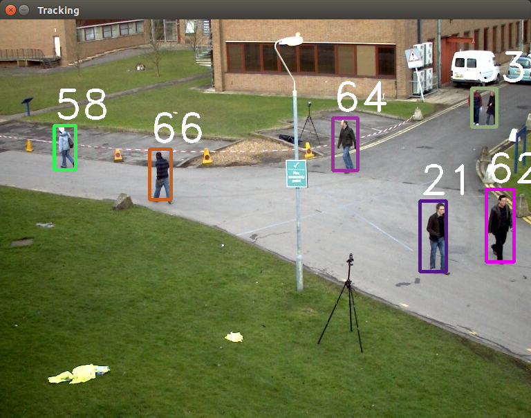
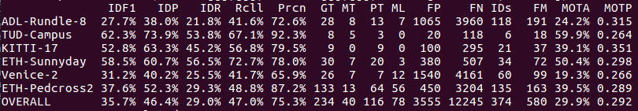

## Introduction
C++ implementation of SORT: Simple, online, and real-time tracking of multiple objects in a video sequence.

Kuhn-Munkres (Hungarian) Algorithm in C++ is forked from:
https://github.com/saebyn/munkres-cpp

## Dependencies
- Ubuntu 16.04
- Docker 18.09.4
- OpenCV 3.4.2
- Boost 1.58.0

> All of the 3rd party libraries are included in the provided docker image

## Build Docker Image
1. Open Dockerfile, change line #19 ARG USERNAME to your host user name (echo $USER)
2. Open a terminal and run:
    ```bash
    $ cd /path/to/sort-cpp
    $ docker build -t sort .
    $ ./docker_run.sh
    ```

## Demo:




To run the tracker with the provided detections and visualize the results:

1. Download the [2D MOT 2015 benchmark dataset](https://motchallenge.net/data/2D_MOT_2015/#download)
2. Create a symbolic link to the dataset
    ```bash
    $ ln -s /path/to/MOT2015_challenge/data/2DMOT2015 /path/to/sort-cpp/mot_benchmark
    ```
3. Run the demo
    ```bash
    $ cd /path/to/sort-cpp
    $ mkdir build && cd "$_"
    $ cmake .. && make
    $ cd /path/to/sort-cpp/bin
    # Without display
    $ ./sort-cpp
    # With display
    $ ./sort-cpp -d
    ```


## Evaluate Metrics

Using the [Python implementation of metrics for benchmarking multiple object trackers (MOT)](https://github.com/cheind/py-motmetrics) to evaluate metrics. 


#### Dataset Structure

```
Layout for ground truth data
    <GT_ROOT>/<SEQUENCE_1>/gt/gt.txt
    <GT_ROOT>/<SEQUENCE_2>/gt/gt.txt
    ...

Layout for test data
    <TEST_ROOT>/<SEQUENCE_1>.txt
    <TEST_ROOT>/<SEQUENCE_2>.txt
    ...

Example:
mot_benchmark
├── test
│   ├── ADL-Rundle-6.txt
│   └── ADL-Rundle-8.txt
└── train
    ├── ADL-Rundle-6
    │   └── gt
    │       └── gt.txt
    └── ADL-Rundle-8
        └── gt
            └── gt.txt


Sequences of ground truth and test will be matched according to the `<SEQUENCE_X>`
string.
```


#### Example

```bash
# Optional for virtualenv
$ source ~/env/bin/activate
$ pip install motmetrics
# Usage
$ python -m motmetrics.apps.eval_motchallenge --help
# Format: python -m motmetrics.apps.eval_motchallenge groundtruths tests
$ python -m motmetrics.apps.eval_motchallenge mot_benchmark/train output/
```


## Result



FPS is around 1900 with Debug build.


## References
1. https://github.com/abewley/sort
2. https://github.com/mcximing/sort-cpp
3. https://github.com/saebyn/munkres-cpp
